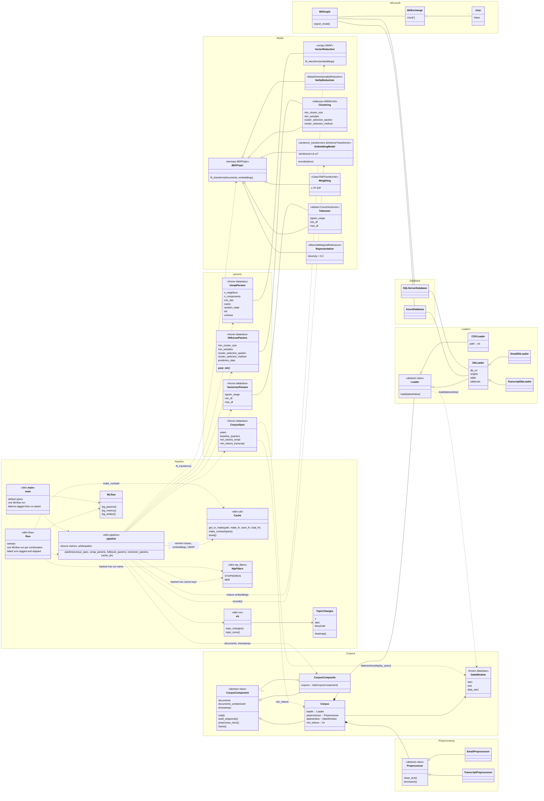

```mermaid
classDiagram
direction LR

namespace Microsoft {

    class MSExchange {
        User[*]
    }

    class User {
       Inbox
    }

    class MSGraph {
        export_email()
    }

}

namespace Database {

    class SQLServerDatabase {
    }
    class AzureDatabase {
    }

}

namespace Loaders {

    class Loader {
        <<abstract class>>
        load(datewindow)
    }

    class CSVLoader {
        path :: str
    }

    class DbLoader {
        db_url
        engine
        table
        tablecols
    }

    class EmailDbLoader {
    }

    class TranscriptDbLoader {
    }

}

namespace Corpora {

    class CorpusComponent {
        <<abstract class>>
        documents
        documents_untokenized
        timestamps
        load()
        build_stopwords()
        preprocess_docs()
        frame()
    }

    class Corpus {
        loader :: Loader
        preprocessor :: Preprocessor
        datewindow :: DateWindow
        min_tokens :: int
    }

    class CorpusComposite {
        corpora :: list[CorpusComponent]
    }

    class DateWindow {
        <<frozen dataclass>>
        start
        end
        data_start
    }

}

namespace Preprocessing {

    class Preprocessor {
        <<abstract class>>
        clean_text()
        lemmatize()
    }

    class EmailPreprocessor {
    }

    class TranscriptPreprocessor {
    }

}

CorpusComponent <|-- Corpus
CorpusComponent <|-- CorpusComposite
CorpusComposite o-- "1..*" CorpusComponent

Corpus *-- Loader
Corpus *-- Preprocessor
Corpus --> DateWindow
Loader ..> DateWindow : load(datewindow)

Loader <|-- CSVLoader
Loader <|-- DbLoader
DbLoader <|-- EmailDbLoader
DbLoader <|-- TranscriptDbLoader

Preprocessor <|-- EmailPreprocessor
Preprocessor <|-- TranscriptPreprocessor

AzureDatabase -- DbLoader
SQLServerDatabase -- DbLoader

MSExchange o-- "*" User
MSGraph -- MSExchange
MSGraph -- AzureDatabase
MSGraph -- SQLServerDatabase


namespace Model {

    class BERTopic {
        <<bertopic.BERTopic>>
        fit_transform(documents, embeddings)
    }

    class VectorReduction {
        <<umap.UMAP>>
        fit_transform(embeddings)
    }

    class NoOpReduction {
        <<BaseDimensionalityReduction>>
    }

    class Clustering {
        <<hdbscan.HDBSCAN>>
        min_cluster_size
        min_samples
        cluster_selection_epsilon
        cluster_selection_method
    }

    class EmbeddingModel {
        <<sentence_transformers.SentenceTransformer>>
        "all-MiniLM-L6-v2"
        encode(docs)
    }

    class Weighting {
        <<ClassTfidfTransformer>>
        c-TF-IDF
    }

    class Tokenizer {
        <<sklearn.CountVectorizer>>
        ngram_range
        min_df
        max_df
    }

    class Representation {
        <<MaximalMarginalRelevance>>
        diversity = 0.2
    }

}

BERTopic o-- NoOpReduction
BERTopic o-- EmbeddingModel
BERTopic o-- Clustering
BERTopic o-- Weighting
BERTopic o-- Tokenizer
BERTopic o-- Representation

namespace params {
    class CorpusSpec {
        <<frozen dataclass>>
        years
        baseline_quarters
        min_tokens_email
        min_tokens_transcript
    }
    class UmapParams {
        <<frozen dataclass>>
        n_neighbors
        n_components
        min_dist
        metric
        random_state
        init
        verbose
    }
    class HdbscanParams {
        <<frozen dataclass>>
        min_cluster_size
        min_samples
        cluster_selection_epsilon
        cluster_selection_method
        prediction_data
        __post_init__()
    }
    class VectorizerParams {
        <<frozen dataclass>>
        ngram_range
        min_df
        max_df
    }
}

CorpusSpec ..> DateWindow : datewindow(display_years)
CorpusSpec ..> Corpus : min_tokens
UmapParams -- VectorReduction
HdbscanParams -- Clustering
VectorizerParams -- Tokenizer

namespace Pipeline {

    class pipeline {
        <<ditm.pipeline>>
        pipeline(corpus_spec, umap_params, hdbscan_params, vectorizer_params, cache_dir)
        returns metrics, artifactpaths
    }

    class Cache {
        <<ditm.util>>
        get_or_make(path, make_fn, save_fn, load_fn)
        make_runhash(parts)
        timeit()
    }

    class NlpFilters {
        <<ditm.nlp_filters>>
        STOPWORDS
        NER
    }

    class viz {
        <<ditm.viz>>
        topic_changes()
        topic_sizes()
    }

    class TopicChanges {
        z
        ratio
        threshold
        heatmap()
    }

    class flow {
        <<ditm.flow>>
        sweeps
        one MLflow run per combination
        failed runs tagged and skipped
    }

    class main {
        <<ditm.__main__>>
        default specs
        one MLflow run
        failures tagged then re-raised
    }

    class MLflow {
        log_params()
        log_metrics()
        log_artifact()
    }

}

pipeline ..> CorpusSpec
pipeline ..> UmapParams
pipeline ..> HdbscanParams
pipeline ..> VectorizerParams
pipeline ..> CorpusComposite : documents, timestamps
pipeline ..> EmbeddingModel : encode()
pipeline ..> VectorReduction : reduce embeddings
pipeline ..> BERTopic : fit_transform()
pipeline ..> Cache : cached corpus, embeddings, UMAP
pipeline ..> NlpFilters : hashed into cache keys
pipeline ..> viz
viz --> TopicChanges
flow ..> pipeline
flow ..> MLflow
flow ..> Cache : make_runhash
flow ..> NlpFilters : hashed into run name
main ..> pipeline
main ..> MLflow
```
